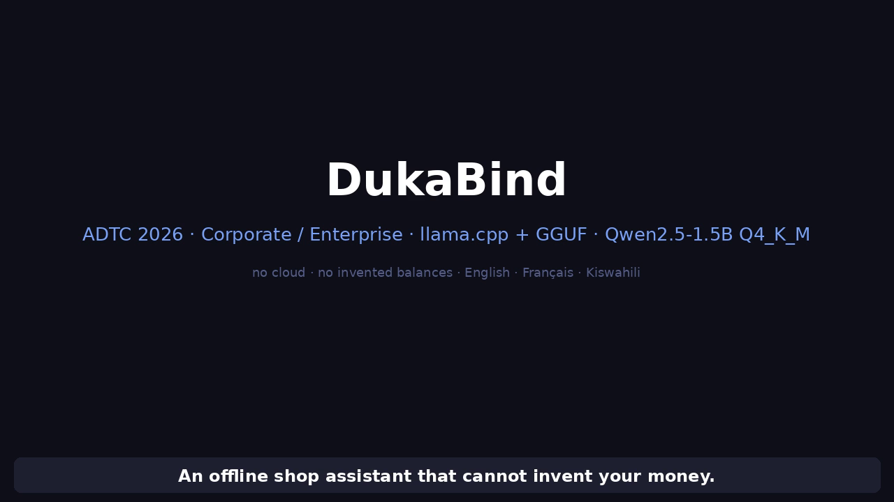
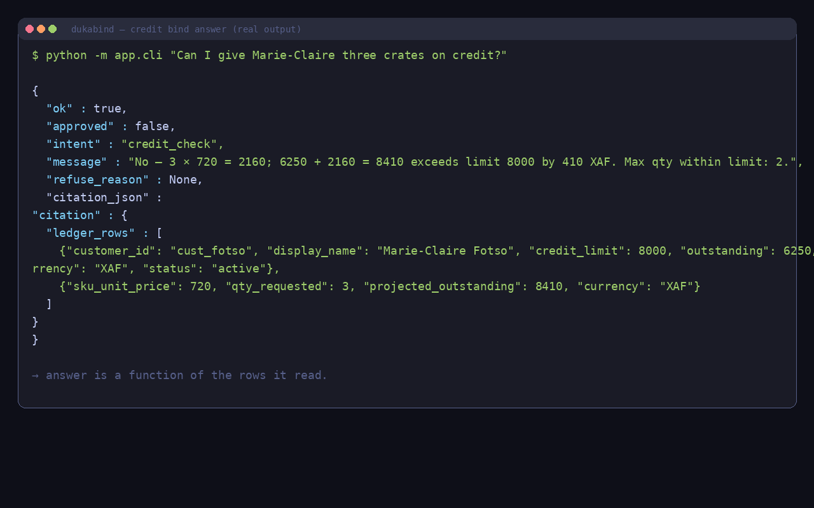
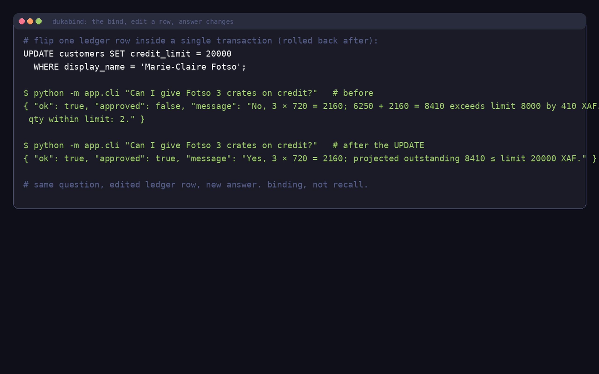
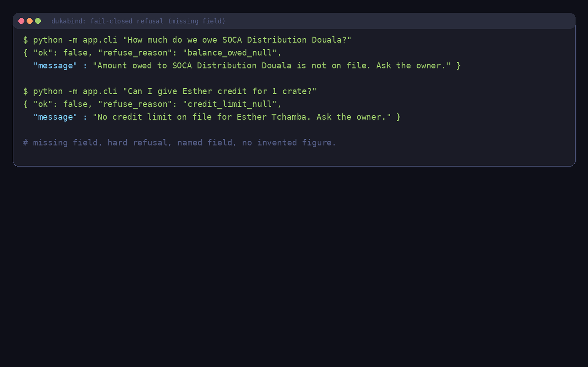
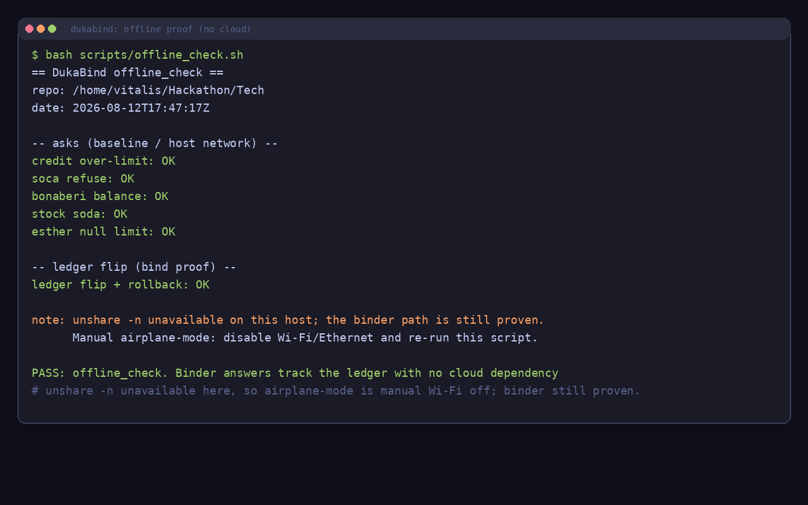
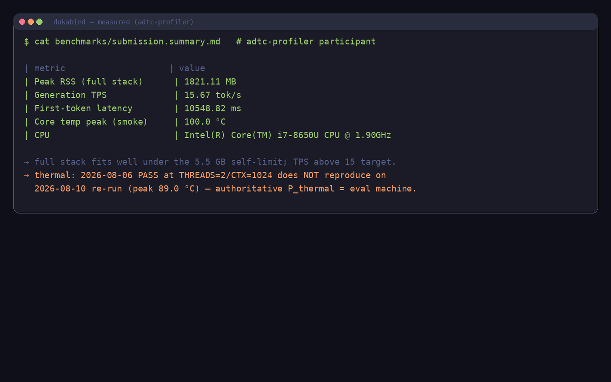
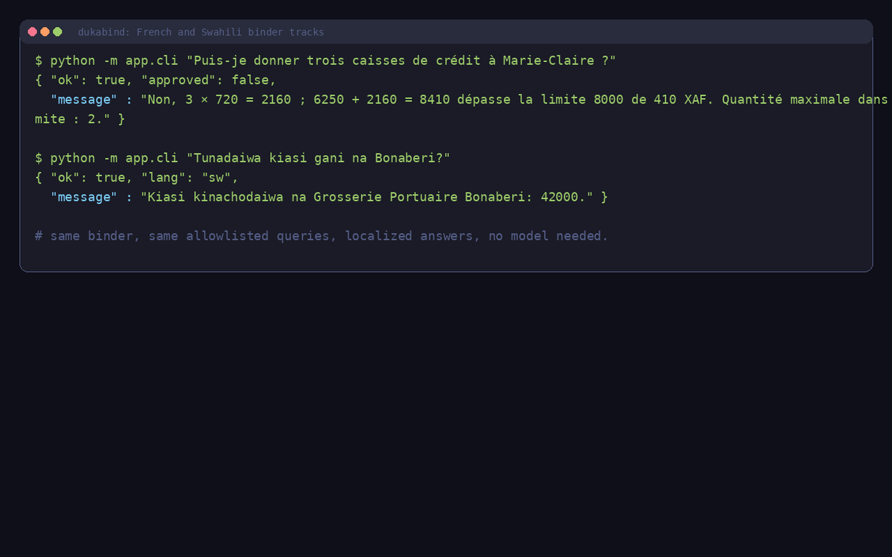

# DukaBind

**An offline shop assistant that cannot invent your money.**

DukaBind is a fail-closed ledger binder for African MSME counters. Staff ask about **credit**, **supplier payables**, or **stock** in **English, French, or Swahili**; the app answers from a local SQLite ledger through a small set of allowlisted queries, and a local GGUF model may narrate *only* the rows those queries returned. Missing data produces a hard refusal, never an invented figure. Change a ledger row, and the answer must change.

> Domain: **Corporate / Enterprise** · Runtime: **llama.cpp + GGUF** · 100 % offline at inference · English, French, Swahili (`language_scope: ["en", "fr", "sw"]`)

---

## Why this is not another chatbot

Most offline LLM demos answer from the model's memory. A model asked to state a customer's balance will produce a plausible number. DukaBind structurally cannot.

1. The model never sees the database. It sees a **JSON citation block** containing exactly the rows an allowlisted query returned, plus a system rule that forbids amounts absent from that block.
2. The binder's deterministic `message` is **authoritative**. The model may polish wording; it never chooses SQL, computes balances, or adds figures.
3. Every ask path is **read-only**: no cloud, no telemetry, no write access. Binder-only asks make **no network call**; optional narration talks only to the local model over **loopback** (127.0.0.1).

Verify it yourself in 30 seconds: edit one `credit_limit` row in the shop ledger and re-ask the same question. That is the whole product: **binding, not recall.**

---

## Quick start (Ubuntu 22.04, Python 3.10+)

```bash
python3 -m venv .venv && source .venv/bin/activate
pip install -r requirements.txt

# 1. Binder tests: no model required (78 tests)
PYTHONPATH=. pytest tests/ -q

# 2. Try the binder directly (no model; the ask path is read-only)
python -m app.db.connection        # create + seed the shop ledger
PYTHONPATH=. python -m app.cli "Can I give Marie-Claire three crates on credit?"

# 3. Offline proof: answers track the ledger with no cloud dependency
bash scripts/offline_check.sh

# 4. Held-out evaluation: EN/FR/SW prompts, two shop ledgers, flip proofs
PYTHONPATH=. .venv/bin/python evals/run_heldout.py
```

Optional local narration (needs the model + a llama.cpp build):

```bash
./download_model.sh               # once; ~1.1 GB GGUF, sha256-verified
bash scripts/setup_llama.sh       # builds llama-server
bash scripts/start_llama_server.sh        # terminal A on 127.0.0.1:8080
PYTHONPATH=. python -m app.narrate_cli "Can I give Marie-Claire three crates on credit?"  # terminal B
```

Full fresh-machine walkthrough (auditor-oriented): [`CONTRIBUTING.md`](CONTRIBUTING.md).

---

## What it answers

| Intent | Example ask (EN / FR / SW) | Behaviour |
|---|---|---|
| Credit check | "Can I give Marie-Claire three crates on credit?" / "Puis-je donner trois caisses de crédit à Marie-Claire ?" / "Ninaweza kumpa Marie-Claire kreti ya makreti matatu?" | Arithmetic vs. the ledger limit; grounded Yes / No with the math shown, in the ask language |
| Supplier balance | "How much do we owe SOCA?" / "Combien devons-nous à SOCA ?" / "Tunadaiwa kiasi gani na SOCA?" | Reads `balance_owed` from the ledger row, localized |
| Stock on hand | "How many soda crates on hand?" / "Combien de sodas en stock ?" / "Tuna hifadhi ngapi ya soda?" | Reads `on_hand` from the ledger row, localized |
| Anything else | "Who owns this shop?", jailbreaks (any language) | Hard refusal: `unknown_intent` or `not_found`, in the ask language |

**Narration:** English and French answers may be narrated by the local model (verified on Qwen2.5-1.5B Q4_K_M). Swahili answers are **binder-only** by design: the deterministic message is authoritative, and the 1.5B model does not reliably narrate Swahili without mangling figures, so narration is deliberately skipped to protect money numbers.

**Fail-closed rule:** a required money field that is `NULL` ("not on file") produces a refusal that names the field. No balance, no limit, and no amount is invented. This applies to `credit_limit`, `outstanding`, and `balance_owed`, enforced by tests including an injection battery.

**Two shop ledgers:** Marché Akwa Viviane (Douala) and Marché Nkolmébé (`duka_b`, Yaoundé) have fully disjoint names and numbers. The held-out flip checks (3/3) demonstrate that, across the tested prompts, answers bind to the currently selected live ledger; they do not claim the system is incapable of memorization in general.

---

## Demo

**108-second demo video** ([play / download](https://github.com/Vitalisn4/dukabind/releases/download/demo-video/demo.mp4) · [release](https://github.com/Vitalisn4/dukabind/releases/tag/demo-video)). It walks through the credit bind answer, a ledger flip (a test harness edits one `credit_limit` row inside a temporary transaction and rolls it back, so the seed ledger is never modified; the answer changes with the row), a fail-closed refusal, **French and Swahili binder asks**, the offline proof, and the measured numbers. English captions are burned in, and every frame is rendered from real CLI output by [`scripts/render_demo_assets.py`](scripts/render_demo_assets.py) (Pillow terminal chrome, not a staff UI). The ask path stays read-only throughout.

[](https://github.com/Vitalisn4/dukabind/releases/download/demo-video/demo.mp4)

<video controls muted preload="metadata" width="100%" poster="https://github.com/Vitalisn4/dukabind/releases/download/demo-video/demo-poster.png" src="https://github.com/Vitalisn4/dukabind/releases/download/demo-video/demo.mp4"></video>

**Watch or download:** [demo.mp4 on the `demo-video` release](https://github.com/Vitalisn4/dukabind/releases/download/demo-video/demo.mp4) (108 s, 1280×720, H.264 Baseline + AAC, ~4.2 MB). Copy in-repo: [`demo/demo.mp4`](demo/demo.mp4). Poster (title card, not a product UI): [`demo/demo-poster.png`](demo/demo-poster.png).

> GitHub’s file browser for repo MP4s often shows a blank page with only **View raw** (download). That is a GitHub limitation, not a broken file. Use the release download / `<video>` embed above to play in the browser.

| | |
|---|---|
|  |  |
| Credit ask answered from the ledger rows it read, with arithmetic shown, not recall. | The bind: a test harness edits one `credit_limit` row in a temporary (rolled-back) transaction, and the same question gives a new answer. |
|  |  |
| Missing field gives a hard refusal that names the field. Never an invented balance. | `offline_check.sh` proves the answers track the ledger with no cloud dependency. |
|  |  |
| Measured: peak RSS 1821.11 MB, 15.67 tok/s, and an honest thermal record (see [`BENCHMARKS.md`](BENCHMARKS.md)). | French (Cameroon official) and Swahili asks answered deterministically in-language, with no model needed. |

---

## Measured performance

| Metric | Result | Target |
|---|---:|---:|
| Peak RSS (full stack) | **1821.11 MB** | < 5.5 GB self-limit |
| Generation speed | **15.67 tok/s** | ≥ 15 tok/s |
| Time to first token | 10548.82 ms | n/a |
| Accuracy self-benchmark | **74.0 %** on `arc_easy` (50 samples, `acc_norm`); toolchain evidence, official S_acc = audit mode | n/a |
| Held-out bind/refuse (T11) | **37/37 = 100.0 %** | ≥ 90 % |
| Held-out checks | **40/40**, flip proofs 3/3 | n/a |
| Thermal soak (10 min) | See [`BENCHMARKS.md`](BENCHMARKS.md): the 2026-08-06 PASS does not reproduce on the build laptop; the authoritative verdict is the official eval machine | < 85 °C |

Numbers above cite the committed freeze snapshot (`benchmarks/submission.json` / `submission.summary.md`, 2026-08-11); `BENCHMARKS.md` also records the 2026-08-06 definitive run. Methodology and raw evidence: [`BENCHMARKS.md`](BENCHMARKS.md) · [`benchmarks/submission.summary.md`](benchmarks/submission.summary.md) · [`MODEL_CARD.md`](MODEL_CARD.md) · held-out report [`evals/heldout/REPORT.md`](evals/heldout/REPORT.md). Every number above traces to a committed measurement. Nothing is invented.

---

## Documentation

| Doc | Purpose |
|---|---|
| [`docs/SECURITY.md`](docs/SECURITY.md) | Threat model and binder security rules (C1-C10) |
| [`docs/DESIGN_DECISIONS.md`](docs/DESIGN_DECISIONS.md) | Research-backed design choices and rejected alternatives |
| [`docs/README.md`](docs/README.md) | Public docs index |
| [`REPORT.md`](REPORT.md) | Gate 1 technical writeup |
| [`MODEL_CARD.md`](MODEL_CARD.md) | Qwen2.5-1.5B Q4_K_M: intended use, limits, honesty |
| [`BENCHMARKS.md`](BENCHMARKS.md) | Measured profiler / thermal numbers (never invented) |
| [`evals/heldout/REPORT.md`](evals/heldout/REPORT.md) | Held-out evidence: T11, flips, both fixtures |
| [`CONTRIBUTING.md`](CONTRIBUTING.md) | Reproduction runbook: fresh machine to verified binder |

---

## Model & license

- **Model:** Qwen2.5-1.5B-Instruct, GGUF **Q4_K_M** (~1.12 GB), pinned with sha256 in [`download_model.sh`](download_model.sh). See [`MODEL_CARD.md`](MODEL_CARD.md).
- **Repository license:** GPL-3.0 (application code); model weights are upstream Apache-2.0 on Hugging Face. See [`NOTICE`](NOTICE).

---

## Contest

ADTC 2026 · [Devpost](https://adtc-2026.devpost.com/) · [Challenge site](https://africadeeptech.org/challenge-2026/) · [adtc-profiler](https://github.com/Africa-Deep-Tech-Foundation/adtc-profiler) · [Submission template](https://github.com/Africa-Deep-Tech-Foundation/adtc-2026-submission-template)

**Builder:** Vitalis Ngam · Solo · [Vitalisn4](https://github.com/Vitalisn4) · Cameroon (ledger fixture: Douala / XAF)
